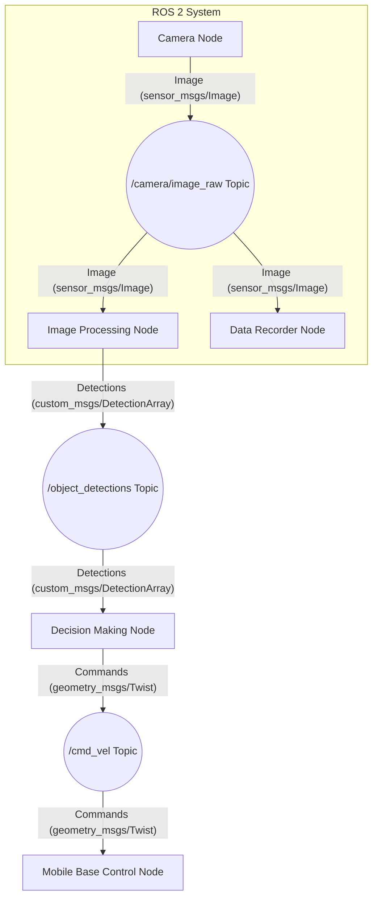

# Chapter 1: The Robotic Nervous System (ROS 2)

## What is ROS 2?

In complex robotic systems, numerous software processes operate concurrently. These processes may include sensor data acquisition, localization algorithms, path planning, and motor control. The Robot Operating System 2 (ROS 2) serves as the **middleware** that facilitates communication and coordination among these diverse components. Unlike a traditional operating system, ROS 2 provides a structured communication layer and a set of development tools over an existing host operating system (e.g., Linux, Windows).

Conceived as the "nervous system" for robots, ROS 2 is responsible for routing sensory information, computational outcomes, and command signals across the entire robotic architecture. It represents the second generation of the ROS framework, engineered with enhanced capabilities for multi-robot systems, real-time control, and deployment in commercial and industrial applications, addressing many limitations of its predecessor.

## The ROS 2 Graph: Nodes, Topics, and Messages

The foundational concept within ROS 2 is the "Graph," which depicts the interconnected network of executable processes known as **nodes**. Each node is designed to perform a specific, well-defined function, promoting modularity and reusability within the robotic software stack.

Nodes communicate primarily through **topics**, which are named buses for data exchange. A node that generates data (a **publisher**) sends messages to a topic. Any node requiring this data (a **subscriber**) listens to the same topic. This publish-subscribe mechanism provides a decoupled architecture, allowing components to operate independently without direct knowledge of each other, enhancing system flexibility and scalability.


*Figure 1.1: A detailed ROS 2 graph illustrating data flow from a Camera Node through image processing and decision-making to ultimately control a mobile base.*

In addition to topics, ROS 2 supports other communication patterns:

*   **Services:** A request-reply mechanism suitable for synchronous, one-to-one communication, often used for tasks that expect an immediate result, such as querying a robot's state or triggering a specific action.
*   **Actions:** Designed for long-running tasks that provide periodic feedback and can be preempted. This pattern is ideal for navigation, manipulation, or other goal-oriented operations.

## Building a ROS 2 Workspace and Package

To organize ROS 2 code, developers utilize a **workspace**, which is a directory containing one or more ROS 2 packages. Let's outline the process for setting up a workspace and creating a Python package.

```bash
# First, source your ROS 2 installation. Replace <distro> with your ROS 2 distribution (e.g., humble, iron).
source /opt/ros/<distro>/setup.bash

# Create a workspace directory and its 'src' subdirectory for source code
mkdir -p ~/ros2_ws/src
cd ~/ros2_ws

# Build the workspace. This command will initialize the build environment.
colcon build

# Navigate into the 'src' directory to create a new ROS 2 Python package
cd src
ros2 pkg create --build-type ament_python --node-name simple_publisher my_ros2_pkg
```

Upon creation, the `my_ros2_pkg` directory will contain several essential files, including `package.xml` for metadata and `setup.py` for the Python build system, alongside a template Python node.

### `package.xml`

The `package.xml` file describes the package's metadata, dependencies, and build system. For our simple example, it will resemble the following:

```xml
<?xml version="1.0"?>
<?xml-model href="http://download.ros.org/schema/package_format3.xsd" schematypens="http://www.w3.org/2001/XMLSchema"?>
<package format="3">
  <name>my_ros2_pkg</name>
  <version>0.0.1</version>
  <description>Demonstrates basic ROS 2 Python publisher and subscriber.</description>
  <maintainer email="your_email@example.com">Your Name</maintainer>
  <license>Apache-2.0</license>

  <depend>rclpy</depend>
  <depend>std_msgs</depend>
  <depend>geometry_msgs</depend> <!-- Added for potential future use or examples -->

  <test_depend>ament_copyright</test_depend>
  <test_depend>ament_flake8</test_depend>
  <test_depend>ament_pep257</test_depend>
  <test_depend>python3-pytest</test_depend>

  <export>
    <build_type>ament_python</build_type>
  </export>
</package>
```

### `setup.py`

The `setup.py` file is crucial for `ament_python` packages, as it instructs `colcon` how to install the package and which Python scripts should be exposed as executable nodes. We will define entry points for both a talker (publisher) and a listener (subscriber) node.

```python
from setuptools import find_packages, setup

package_name = 'my_ros2_pkg'

setup(
    name=package_name,
    version='0.0.1',
    packages=find_packages(exclude=['test']),
    data_files=[
        ('share/ament_index/resource_index/packages',
            ['resource/' + package_name]),
        ('share/' + package_name, ['package.xml']),
    ],
    install_requires=['setuptools'],
    zip_safe=True,
    maintainer='Your Name',
    maintainer_email='your_email@example.com',
    description='A simple ROS 2 Python publisher and subscriber example.',
    license='Apache-2.0',
    tests_require=['pytest'],
    entry_points={
        'console_scripts': [
            'talker = my_ros2_pkg.talker:main',
            'listener = my_ros2_pkg.listener:main',
        ],
    },
)
```
*Note: We assume the presence of `talker.py` and `listener.py` within the `my_ros2_pkg` directory.*

## Writing the Publisher and Subscriber Nodes

Let's implement a simple publisher (`talker`) and subscriber (`listener`) to demonstrate topic-based communication. Ensure these files are created in `~/ros2_ws/src/my_ros2_pkg/my_ros2_pkg/`.

#### `my_ros2_pkg/talker.py` (Publisher Node)
This node publishes a simple string message to the `/chatter` topic every 0.5 seconds.

```python
import rclpy
from rclpy.node import Node
from std_msgs.msg import String

class TalkerNode(Node):
    """
    A ROS 2 node that publishes 'Hello from ROS 2' messages to a topic.
    """
    def __init__(self):
        super().__init__('talker_node')
        self.publisher_ = self.create_publisher(String, 'chatter', 10)
        self.timer = self.create_timer(0.5, self._timer_callback) # Publish every 0.5 seconds
        self.message_counter = 0

    def _timer_callback(self):
        """
        Callback function executed by the timer to publish messages.
        """
        msg = String()
        msg.data = f'Hello from ROS 2: {self.message_counter}'
        self.publisher_.publish(msg)
        self.get_logger().info(f'Publishing: "{msg.data}"')
        self.message_counter += 1

def main(args=None):
    rclpy.init(args=args) # Initialize ROS 2 for the Python client library
    node = TalkerNode()   # Create the Talker node
    try:
        rclpy.spin(node)  # Keep the node running until interrupted
    except KeyboardInterrupt:
        node.get_logger().info("Talker node stopped cleanly.")
    finally:
        node.destroy_node() # Clean up resources
        rclpy.shutdown()    # Shut down ROS 2
```

#### `my_ros2_pkg/listener.py` (Subscriber Node)
This node subscribes to the `/chatter` topic and prints any received messages to the console.

```python
import rclpy
from rclpy.node import Node
from std_msgs.msg import String

class ListenerNode(Node):
    """
    A ROS 2 node that subscribes to 'chatter' messages and prints them.
    """
    def __init__(self):
        super().__init__('listener_node')
        self.subscription = self.create_subscription(
            String,
            'chatter',
            self._listener_callback,
            10)
        self.get_logger().info('Listener node initialized. Waiting for messages...')

    def _listener_callback(self, msg):
        """
        Callback function executed upon receiving a message on the 'chatter' topic.
        """
        self.get_logger().info(f'I heard: "{msg.data}"')

def main(args=None):
    rclpy.init(args=args) # Initialize ROS 2
    node = ListenerNode() # Create the Listener node
    try:
        rclpy.spin(node)  # Keep the node running
    except KeyboardInterrupt:
        node.get_logger().info("Listener node stopped cleanly.")
    finally:
        node.destroy_node() # Clean up resources
        rclpy.shutdown()    # Shut down ROS 2
```

### Building and Running the Nodes

After placing these files, navigate to the root of your `ros2_ws` and perform a `colcon build`. Then, source the setup files and run the nodes in separate terminals.

```bash
# From ~/ros2_ws/
colcon build

# Source the setup files to make your package executables visible to ROS 2
source install/setup.bash

# In a new terminal, run the talker node
ros2 run my_ros2_pkg talker

# In another new terminal, run the listener node
ros2 run my_ros2_pkg listener
```
You should observe the `talker` node publishing messages and the `listener` node receiving and printing them.

---

### Exercises

1.  **Conceptual Understanding:** Explain the significance of the `QoS (Quality of Service)` history depth parameter (e.g., `10` in `create_publisher(String, 'chatter', 10)`). How might changing this value affect communication in scenarios with high message rates or unreliable networks?
2.  **Code Modification & Testing:**
    a. Modify `talker.py` to publish messages faster (e.g., every 0.1 seconds) and `listener.py` to only process every 5th message it receives.
    b. After modification, describe the build and run commands you would use to verify your changes.
3.  **New Node Development:** Create a new Python node within `my_ros2_pkg` called `message_analyzer.py`. This node should subscribe to the `/chatter` topic, parse the integer count from the "Hello from ROS 2: X" string, and calculate the average of the last 10 received integer counts. Print this average every time a new message arrives. Remember to update `setup.py` and rebuild.
4.  **URDF Integration (Conceptual):** Imagine you have a simple robot arm described in URDF. What kind of ROS 2 topics would this arm typically publish (output) and subscribe to (input) to be controlled and monitored? Provide examples of message types you might use.
5.  **Troubleshooting:** You run `ros2 run my_ros2_pkg talker` but receive an error "command not found". List the possible reasons for this error and the steps you would take to troubleshoot it.
