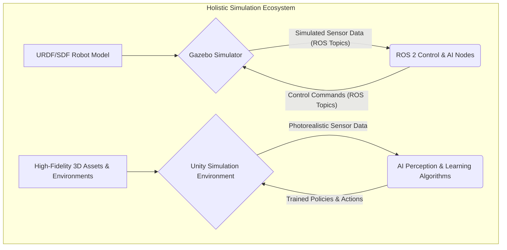

# Chapter 3: Digital Twins and Simulation (Gazebo & Unity)

## The Power of Digital Twins: Why Simulate?

A **Digital Twin** in robotics is a high-fidelity virtual replica of a physical robot and its operational environment. Beyond mere 3D visualization, it accurately mirrors the robot's mechanical behavior, sensor outputs, and actuator responses, while also simulating the underlying physics of the world. Digital twins are cornerstones of modern AI and robotics development, providing a safe, scalable, and efficient platform for iterative design and rigorous testing.

The strategic advantages of leveraging digital twins include:

1.  **Enhanced Safety:** Critical and potentially hazardous scenarios can be tested without risk to physical hardware, personnel, or property.
2.  **Accelerated Development:** Simulations can run significantly faster than real-time, drastically reducing the development cycle for AI algorithms and control strategies. This enables parallel execution of numerous experiments.
3.  **Cost Efficiency:** Development and debugging within a virtual environment mitigate the need for expensive physical prototypes and reduce operational expenditures.
4.  **Reproducibility:** Specific test conditions and scenarios can be precisely replicated, which is vital for systematic debugging, performance evaluation, and comparative analysis of algorithms.
5.  **Ground Truth Access:** Simulations provide access to "ground truth" data—exact positions, velocities, forces, and other internal states—that are often impractical or impossible to obtain from physical sensors. This invaluable data is critical for advanced AI training and deep analytical insights.

## Gazebo: The ROS-Integrated Simulator

**Gazebo** stands as the foundational simulation environment within the ROS ecosystem. This open-source, high-performance physics simulator offers robust capabilities for emulating complex robots in realistic environments. Its tight integration with ROS facilitates seamless communication between simulated robots and ROS 2 nodes, thereby streamlining the transition from virtual prototyping to real-world deployment.

Key functionalities of Gazebo encompass:

*   **Advanced Physics Engine:** Support for multiple physics engines (e.g., ODE, Bullet, Simbody, DART) ensures accurate simulation of rigid-body dynamics, contact forces, and frictional interactions.
*   **Rich 3D Visualization:** A powerful 3D rendering engine provides an immersive visual environment for observing simulations.
*   **Comprehensive Sensor Modeling:** A versatile plugin architecture allows for the simulation of a broad spectrum of sensors, including cameras, LiDAR, Inertial Measurement Units (IMUs), and force/torque sensors.
*   **ROS 2 Compatibility:** Extensive plugins bridge data and control streams between Gazebo and ROS 2 topics, services, and actions.

### Defining a Gazebo World with SDF

Environments within Gazebo are typically defined using **SDF (Simulation Description Format)** files. SDF is an XML-based format capable of describing static elements like terrain, buildings, and furniture, as well as dynamic objects with complex physical properties.

Below is a minimal SDF world file that establishes a flat ground plane and a basic light source:

```xml
<?xml version="1.0" ?>
<sdf version="1.7">
  <world name="minimal_robotics_world">
    <!-- A global directional light source -->
    <include>
      <uri>model://sun</uri>
    </include>
    <!-- A simple ground plane for interaction -->
    <include>
      <uri>model://ground_plane</uri>
    </include>

    <!-- Example: Add a static box model -->
    <model name="my_static_box">
      <pose>1.5 0 0.5 0 0 0</pose> <!-- Position (x y z) and orientation (roll pitch yaw) -->
      <link name="box_link">
        <collision name="collision">
          <geometry><box><size>1.0 1.0 1.0</size></box></geometry>
        </collision>
        <visual name="visual">
          <geometry><box><size>1.0 1.0 1.0</size></box></geometry>
          <material><script><name>Gazebo/Green</name></script></material>
        </visual>
        <inertial>
          <mass>1.0</mass>
          <inertia ixx="0.166667" ixy="0" ixz="0" iyy="0.166667" iyz="0" izz="0.166667"/>
        </inertial>
      </link>
    </model>
  </world>
</sdf>
```

To launch Gazebo with a specific world file, use the command:
```bash
gazebo my_robot_testing_world.sdf
```

## Spawning Robots and Simulating Sensors

Integrating a robot model (e.g., defined by URDF from Chapter 2) into a Gazebo world, and subsequently simulating its sensors and actuators, is managed through ROS 2 launch files and specialized **Gazebo plugins**. These plugins are shared libraries loaded alongside the robot model or world, extending Gazebo's core functionality.

For instance, to simulate a camera and stream its output to ROS 2, a `gazebo` tag embedding a camera plugin is added to your robot's URDF/XACRO description:

```xml
<!-- Excerpt from a robot's XACRO/URDF file detailing a camera sensor -->
<link name="camera_link">
  <visual>
    <geometry><box><size>0.05 0.05 0.05</size></box></geometry>
    <material name="black"/>
  </visual>
  <collision>
    <geometry><box><size>0.05 0.05 0.05</size></box></geometry>
  </collision>
  <inertial>
    <mass value="0.01"/>
    <inertia ixx="0.00001" ixy="0" ixz="0" iyy="0.00001" iyz="0" izz="0.00001"/>
  </inertial>
</link>
<joint name="camera_joint" type="fixed">
  <parent link="base_link"/>
  <child link="camera_link"/>
  <origin xyz="0.1 0 0.2" rpy="0 0 0"/>
</joint>

<gazebo reference="camera_link">
  <sensor name="stereo_camera" type="camera">
    <pose>0 0 0 0 0 0</pose>
    <visualize>true</visualize>
    <update_rate>30.0</update_rate>
    <camera>
      <horizontal_fov>1.047</horizontal_fov> <!-- Approximately 60 degrees -->
      <image>
        <width>640</width>
        <height>480</height>
        <format>R8G8B8</format>
      </image>
      <clip>
        <near>0.05</near>
        <far>8.0</far>
      </clip>
    </camera>
    <!-- ROS 2 Camera Plugin -->
    <plugin name="camera_controller" filename="libgazebo_ros_camera.so">
      <alwaysOn>true</alwaysOn>
      <topicName>/robot/camera/image_raw</topicName>
      <cameraName>robot_camera</cameraName>
      <frameName>camera_link</frameName>
      <hackBaseline>0.07</hackBaseline> <!-- For stereo camera simulation -->
    </plugin>
  </sensor>
</gazebo>
```
This XML snippet defines a camera mounted on `camera_link`, specifying its optical properties (FOV, resolution) and update rate. The `libgazebo_ros_camera.so` plugin then publishes the simulated image data to the `/robot/camera/image_raw` ROS 2 topic, making it accessible to any other subscribing ROS 2 node.

Similarly, a LiDAR sensor can be integrated:

```xml
<gazebo reference="lidar_link">
  <sensor name="robot_lidar" type="ray">
    <pose>0 0 0 0 0 0</pose>
    <visualize>true</visualize>
    <update_rate>10.0</update_rate>
    <ray>
      <scan>
        <horizontal>
          <samples>720</samples>
          <resolution>1</resolution>
          <min_angle>-2.356</min_angle> <!-- -135 degrees -->
          <max_angle>2.356</max_angle>  <!-- +135 degrees -->
        </horizontal>
      </scan>
      <range>
        <min>0.1</min>
        <max>30.0</max>
        <resolution>0.01</resolution>
      </range>
    </ray>
    <!-- ROS 2 LiDAR Plugin -->
    <plugin name="gazebo_ros_lidar_controller" filename="libgazebo_ros_laser.so">
      <topicName>/robot/scan</topicName>
      <frameName>lidar_link</frameName>
    </plugin>
  </sensor>
</gazebo>
```
This modular approach allows for the creation of highly detailed and interactive robotic simulations, where sensors and actuators behave akin to their real-world counterparts.

## Beyond Gazebo: High-Fidelity Simulation with Unity

While Gazebo excels in physics accuracy and deep integration with ROS, its graphical rendering capabilities can be a limiting factor, particularly for AI perception models that benefit from photorealistic sensor data. For applications demanding superior visual fidelity, advanced graphical effects, or direct integration with machine learning frameworks like Unity ML-Agents, **Unity** emerges as a powerful alternative or complementary simulation platform.

Unity, a widely adopted real-time 3D development platform, offers:

*   **Photorealistic Graphics:** Capabilities to generate highly detailed and visually realistic environments, complete with sophisticated lighting, textures, and visual effects. This is crucial for techniques like domain randomization, which aims to bridge the "sim-to-real" gap by exposing AI models to a vast diversity of visual stimuli during training.
*   **ML-Agents Toolkit:** A robust framework enabling the training of intelligent agents through reinforcement learning within Unity environments.
*   **Cross-Platform Deployability:** The ability to develop simulations deployable across a multitude of platforms.

Integrating Unity with ROS 2, while often requiring custom bridging solutions or specialized tools like the Unity Robotics Hub, provides unparalleled flexibility for crafting bespoke, visually rich training scenarios vital for advanced AI perception. The choice between Gazebo and Unity ultimately hinges on the specific simulation priorities: Gazebo for robust physics and native ROS integration, Unity for cutting-edge visuals and direct machine learning research.


*Figure 3.1: A comprehensive view of the simulation ecosystem, illustrating Gazebo's role with ROS 2 for physics and control, and Unity's application for high-fidelity visual simulation and AI training.*

---

### Exercises

1.  **Conceptual Reasoning:** You are tasked with developing a robust navigation system for a humanoid robot in an indoor office environment. Beyond safety and cost, articulate two additional compelling reasons why initial development and extensive testing should be conducted in a digital twin environment rather than directly on the physical hardware.
2.  **SDF World Enhancement:** Expand upon the provided basic SDF world file. Add a second static box model (e.g., a 0.75m cube) at a different location (e.g., x=-1.0, y=1.0, z=0.375) and assign it a distinct color (e.g., blue).
3.  **Sensor Comparative Analysis:** For a humanoid robot requiring precise object manipulation, differentiate between the primary advantages and disadvantages of using a simulated stereo camera (for depth perception) versus a simulated 3D LiDAR for object recognition and pose estimation in a cluttered workspace.
4.  **Gazebo Plugin Configuration:** Examine the provided camera sensor plugin XML.
    a. How would you modify the `<image>` tag to produce higher resolution images (e.g., 1280x720 pixels)?
    b. What change is needed to increase the camera's refresh rate to 60 frames per second?
    c. If you wanted the camera's images to be published to a more specific topic, such as `/humanoid/left_eye/image`, which parameter would you adjust?
5.  **Platform Selection Scenario:** Describe two distinct robotic development scenarios: one where Unity would be the unequivocally superior simulation platform, and another where Gazebo would be the clear choice. Justify your selections based on the unique strengths of each platform.