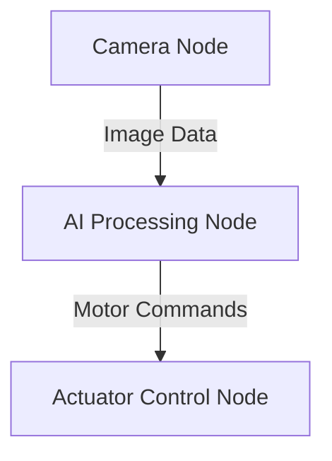

# Path: docs/intro.md

---
id: intro
title: Introduction
slug: /
---

Welcome to the **Physical AI & Humanoid Robotics** book! This guide covers the fundamentals and advanced concepts of embodied intelligence, ROS 2, AI planning, and humanoid robots.

Welcome to a comprehensive exploration of Physical AI and Humanoid Robotics. This textbook is crafted for students, researchers, and engineers at the intersection of artificial intelligence and physical systems. We will bridge the gap between abstract algorithms and tangible, real-world actions.

Physical AI gives intelligence a body, enabling it to perceive, reason, and act within our dynamic world. This embodiment is the key to creating machines that can perform meaningful tasks in human-centric environments, from manufacturing and logistics to healthcare and assistance.

### The Robotic Nervous System: ROS 2

At the core of modern robotics lies the Robot Operating System (ROS 2), a framework that standardizes how different parts of a robot's software communicate. It acts as a nervous system, allowing disparate components—like sensors, actuators, and decision-making algorithms—to work together seamlessly.

A simple ROS 2 system might consist of a node that publishes data (like a sensor reading) and another that subscribes to it.



### Your First ROS 2 Publisher

To make this concrete, let's write a simple "talker" node in Python using `rclpy`. This node will repeatedly publish a "Hello, World" message to a topic.

```python
# 'talker_node.py'
import rclpy
from rclpy.node import Node
from std_msgs.msg import String

class Talker(Node):
    def __init__(self):
        super().__init__('talker_node')
        self.publisher_ = self.create_publisher(String, 'chatter', 10)
        self.timer = self.create_timer(0.5, self.timer_callback)
        self.i = 0

    def timer_callback(self):
        msg = String()
        msg.data = f'Hello World: {self.i}'
        self.publisher_.publish(msg)
        self.get_logger().info(f'Publishing: "{msg.data}"')
        self.i += 1

def main(args=None):
    rclpy.init(args=args)
    talker = Talker()
    rclpy.spin(talker)
    talker.destroy_node()
    rclpy.shutdown()

if __name__ == '__main__':
    main()
```

This code defines a simple class that inherits from the ROS 2 `Node`. In its constructor, it creates a publisher and a timer. The timer's callback function is where the message is created, populated, and published.

### From Code to Action

Throughout this book, we will expand on these foundational concepts. You will learn to build the "digital twin" of a robot in simulation, train its AI brain using advanced tools, and deploy that intelligence into a physical system that can see, understand, and act.

---

### Exercises

1.  **Conceptual:** Why is a standardized communication framework like ROS 2 essential for complex robotic systems? What problems would you encounter without it?
2.  **Modification:** How would you modify the `Talker` node to publish messages at a rate of 5 Hz (i.e., once every 0.2 seconds)?
3.  **Analysis:** In the Mermaid diagram, what kind of information might the "AI Processing Node" send to the "Actuator Control Node"? Provide two examples.
4.  **Research:** What are the key differences between ROS 1 and ROS 2? Why did the community move to the newer version?
