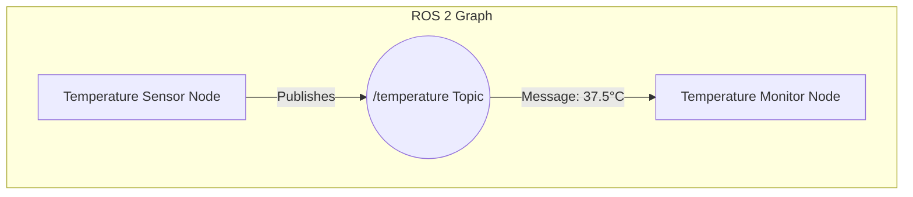

# Chapter 1: ROS 2 (The Robotic Nervous System)

## An Overview of the Robot Operating System

In any complex robot, dozens of software processes run simultaneously. One process might read from a laser scanner, another might calculate the robot's position, a third could plan a path, and a fourth would send control commands to the wheel motors. How do all these independent pieces of software find each other, exchange data, and work together to achieve a common goal?

This is the problem that the Robot Operating System (ROS) solves. Despite its name, ROS is not a traditional operating system like Windows or Linux. Instead, it is **middleware**—a software layer that provides services to applications beyond those available from the operating system. You can think of it as the nervous system for a robot, responsible for routing sensory information, motor commands, and other signals between the brain, sensors, and actuators.

ROS 2 is the second generation of this framework, redesigned from the ground up to support modern robotics applications, including multi-robot systems, real-time control, and deployment in commercial products. It offers a standardized architecture that allows robotics developers to share and reuse code, dramatically accelerating the pace of innovation.

## The Core of ROS 2: The Graph

The fundamental concept in ROS 2 is the "Graph." The Graph is the network of all the ROS 2 nodes in the system and the connections between them. A **node** is the smallest unit of executable code in ROS. Each node should be responsible for a single, well-defined purpose, such as controlling a single sensor, running a specific algorithm, or actuating a component.

Nodes communicate with each other using a small set of well-defined communication patterns:

1.  **Topics:** This is a one-to-many communication channel. A node that wants to share data (e.g., a camera driver) **publishes** messages to a topic. Any other node that wants to receive that data (e.g., an image processing node) **subscribes** to that same topic. This is the most common communication method in ROS.
2.  **Services:** This is a one-to-one, request-reply communication pattern. One node (the **client**) sends a request to another node (the **server**) and waits for a response. This is useful for commands or queries that should be completed before the client continues, such as "get the robot's current map" or "trigger the camera's shutter."
3.  **Actions:** This is a more complex, one-to-one communication pattern for long-running tasks that provide feedback. An **action client** sends a goal to an **action server** (e.g., "navigate to the kitchen"). The server begins executing the goal and can send a stream of feedback messages back to the client (e.g., "current distance to goal is 5.2 meters"). The client can also cancel the goal at any time.

This modular, message-based architecture is the key to ROS's power and flexibility.

## A Practical Example: The Publisher-Subscriber Model

Let's illustrate the most common pattern, publisher-subscriber, with a simple example. Imagine we have a robot with a temperature sensor. We want one node to read the sensor and publish the data, and a second node to subscribe to that data and decide if the temperature is too high.

Here is the Mermaid diagram representing our simple ROS 2 Graph:


*Diagram 1.1: A simple ROS 2 graph where a sensor node publishes data to a topic, and a monitor node subscribes to it.*

### Creating a ROS 2 Workspace

Before we write code, we need a ROS 2 workspace. This is a directory where you will store and build your ROS 2 packages.

```bash
# First, source your ROS 2 installation
# Replace <distro> with your ROS 2 version (e.g., humble, iron)
source /opt/ros/<distro>/setup.bash

# Create a workspace directory
mkdir -p ros2_ws/src
cd ros2_ws

# Build the workspace (even if it's empty)
colcon build
```

### Writing the Publisher Node (Python)

Now, let's create a package and write our temperature publisher node using `rclpy` (the ROS 2 Python client library).

```bash
# Navigate to the source directory
cd src

# Create a new package
ros2 pkg create --build-type ament_python --node-name temp_publisher my_sensor_package
```

Now, open the file `ros2_ws/src/my_sensor_package/my_sensor_package/temp_publisher.py` and replace its content with the following:

```python
import rclpy
from rclpy.node import Node
from std_msgs.msg import Float64  # Using a standard message type for simplicity
import random

class TemperaturePublisher(Node):
    """A node that simulates reading a temperature sensor and publishing its value."""

    def __init__(self):
        super().__init__('temperature_publisher')
        self.publisher_ = self.create_publisher(Float64, 'temperature', 10)
        self.timer = self.create_timer(1.0, self.timer_callback) # 1 Hz timer
        self.get_logger().info('Temperature Publisher node has been started.')

    def timer_callback(self):
        """Called periodically by the timer to publish a new temperature reading."""
        # Simulate reading a sensor
        temp_celsius = 25.0 + random.uniform(-1.0, 1.0)
        
        msg = Float64()
        msg.data = temp_celsius
        
        self.publisher_.publish(msg)
        self.get_logger().info(f'Publishing: "{temp_celsius:.2f}°C"')

def main(args=None):
    rclpy.init(args=args)
    temp_publisher = TemperaturePublisher()
    rclpy.spin(temp_publisher)
    
    # Destroy the node explicitly
    temp_publisher.destroy_node()
    rclpy.shutdown()

if __name__ == '__main__':
    main()
```
This node initializes itself, creates a publisher on the `/temperature` topic, and sets up a timer that fires once per second. The `timer_callback` function simulates reading a sensor and publishes the value as a `Float64` message.

### Writing the Subscriber Node (Python)

Next, let's create the subscriber.

```bash
# While in the ros2_ws/src directory
ros2 pkg create --build-type ament_python --node-name temp_monitor my_monitor_package
```
Open `ros2_ws/src/my_monitor_package/my_monitor_package/temp_monitor.py` and replace its content:

```python
import rclpy
from rclpy.node import Node
from std_msgs.msg import Float64

class TemperatureMonitor(Node):
    """A node that subscribes to temperature data and checks if it's too high."""

    def __init__(self):
        super().__init__('temperature_monitor')
        self.subscription = self.create_subscription(
            Float64,
            'temperature',
            self.listener_callback,
            10)
        self.get_logger().info('Temperature Monitor node has been started.')
        self.declare_parameter('alert_threshold', 25.5) # Make threshold configurable

    def listener_callback(self, msg):
        """Called every time a message is received on the 'temperature' topic."""
        alert_threshold = self.get_parameter('alert_threshold').get_parameter_value().double_value
        temperature = msg.data
        
        self.get_logger().info(f'Received: "{temperature:.2f}°C"')
        
        if temperature > alert_threshold:
            self.get_logger().warn(f'ALERT! Temperature ({temperature:.2f}°C) is above the threshold ({alert_threshold}°C)!')

def main(args=None):
    rclpy.init(args=args)
    temp_monitor = TemperatureMonitor()
    rclpy.spin(temp_monitor)

    temp_monitor.destroy_node()
    rclpy.shutdown()

if __name__ == '__main__':
    main()
```
This node creates a subscription to the `/temperature` topic. Whenever a message arrives, the `listener_callback` function is executed, which logs the received data and prints a warning if it exceeds a configurable threshold.

## Exercises

1.  **Conceptual Question:** In your own words, explain why ROS is considered a "meta-operating system" or "middleware" and not a true OS. What primary problem does it solve for robotics developers?

2.  **System Design:** You are tasked with building a simple mobile robot that wanders around and avoids obstacles. It has a LiDAR for sensing distance and two wheel motors for movement. Sketch a ROS 2 Graph for this system using Mermaid syntax. You should have at least three nodes. What topics would they use to communicate?

3.  **Code Analysis:** In the `TemperatureMonitor` node, the `alert_threshold` is created using `declare_parameter`. What is the advantage of using a parameter for this value instead of hard-coding it as a variable inside the class (e.g., `self.alert_threshold = 25.5`)?

4.  **Extending the Code:** Modify the `TemperaturePublisher` code. Instead of publishing a random temperature, make it publish a value that slowly and continuously increases over time. For example, start at 20°C and increase by 0.1°C every second.

5.  **Running the Code (Theory):** Describe the steps you would need to take to build and run the two nodes you created (`temp_publisher` and `temp_monitor`). List the commands you would use in the terminal, assuming you are in your `ros2_ws`. How would you run the monitor node with a different `alert_threshold`, for example, 24.0?