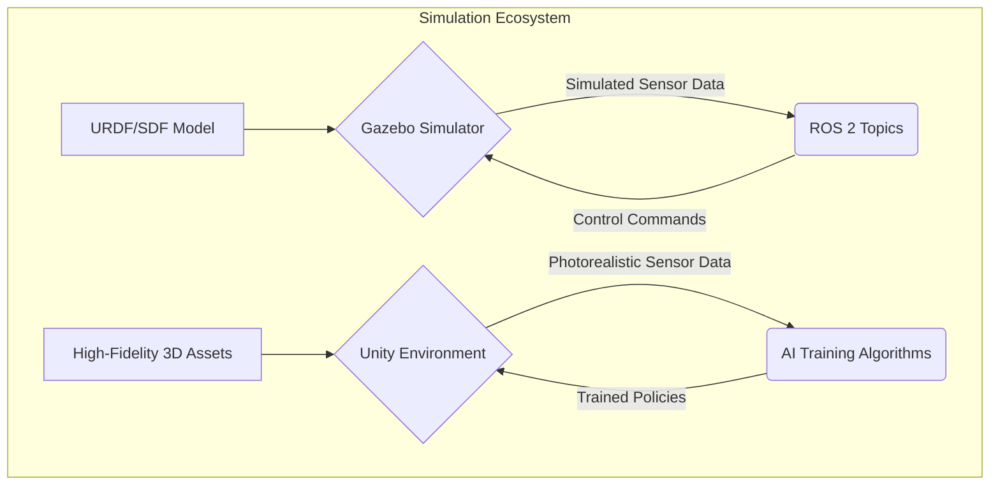

# Chapter 3: Digital Twins and Simulation (Gazebo & Unity)

## The Power of Digital Twins: Why Simulate?

In robotics, a **Digital Twin** is a virtual, physics-based replica of a physical robot and its environment. It's not just a 3D model; it accurately simulates the robot's mechanical properties, sensor outputs, actuator responses, and the physics of the world. Digital twins are indispensable for modern AI and robotics development, offering a safe, scalable, and efficient platform for experimentation.

Key advantages of using digital twins:

1.  **Safety:** Test dangerous or failure-prone scenarios without risking physical hardware or human injury.
2.  **Speed:** Run simulations much faster than real-time, accelerating AI training and algorithm validation. Thousands of parallel simulations can be executed on powerful hardware.
3.  **Cost-Effectiveness:** Develop and debug complex systems in a virtual environment, reducing the need for expensive physical prototypes and minimizing operational costs.
4.  **Reproducibility:** Easily recreate specific test conditions and scenarios, which is crucial for debugging and comparing different algorithms.
5.  **Perfect Information (Ground Truth):** Access to precise state information (e.g., exact object positions, velocities, forces) that would be difficult or impossible to measure on a physical robot. This "ground truth" is invaluable for AI training and analysis.

## Gazebo: The ROS-Integrated Simulator

**Gazebo** is the de-facto standard simulator for the ROS ecosystem. It is an open-source, high-performance physics simulator that provides robust capabilities for simulating complex robots in realistic environments. Gazebo is tightly integrated with ROS, allowing seamless communication between simulated robots and ROS 2 nodes, facilitating a smooth transition from simulation to real-world deployment.

Key features of Gazebo include:
*   **Physics Engine:** Supports various physics engines (ODE, Bullet, Simbody, DART) to simulate realistic rigid-body dynamics, friction, and contact.
*   **3D Graphics:** Provides a rich 3D visualization environment.
*   **Sensor Simulation:** Offers plugins to simulate a wide range of sensors, including cameras, LiDAR, IMUs, force/torque sensors, and more.
*   **ROS 2 Integration:** Comprehensive set of plugins to bridge data and control between Gazebo and ROS 2 topics, services, and actions.

### Setting up a Gazebo World

Environments in Gazebo are typically defined using **SDF (Simulation Description Format)** files. An SDF file can describe everything from simple ground planes and primitive shapes to complex models of buildings, furniture, and dynamically interacting objects.

Here's a basic SDF world file that defines a flat ground plane and a directional light source (sun):

```xml
<?xml version="1.0" ?>
<sdf version="1.7">
  <world name="robot_testing_world">
    <!-- A global light source -->
    <include>
      <uri>model://sun</uri>
    </include>
    <!-- A simple ground plane -->
    <include>
      <uri>model://ground_plane</uri>
    </include>

    <!-- Optional: Add a simple box model -->
    <model name="my_box">
      <pose>1 0 0.5 0 0 0</pose> <!-- x y z roll pitch yaw -->
      <link name="box_link">
        <collision name="collision">
          <geometry><box><size>1 1 1</size></box></geometry>
        </collision>
        <visual name="visual">
          <geometry><box><size>1 1 1</size></box></geometry>
          <material><script><name>Gazebo/Green</name></script></material>
        </visual>
        <inertial>
          <mass>1.0</mass>
          <inertia ixx="0.166667" ixy="0" ixz="0" iyy="0.166667" iyz="0" izz="0.166667"/>
        </inertial>
      </link>
    </model>
  </world>
</sdf>
```

You can launch Gazebo with a specific world file using the `gazebo` command:
```bash
# Launch Gazebo with the specified world file
gazebo my_robot_testing_world.sdf
```

## Spawning Your Robot and Simulating Sensors

To bring our robot (defined by a URDF from Chapter 2) into a Gazebo world, we use ROS 2 launch files and Gazebo's model spawning capabilities. Crucially, to make the robot interact with the physics engine and to simulate its sensors, we rely on **Gazebo plugins**.

A Gazebo plugin is a shared library that gets loaded with the robot model or world and extends Gazebo's functionality. For example, to simulate a camera, you add a `gazebo` tag with a camera plugin to your URDF/XACRO file:

```xml
<!-- Example snippet from a robot's XACRO/URDF file for a camera sensor -->
<link name="camera_link">
  <visual>...</visual>
  <collision>...</collision>
  <inertial>...</inertial>
</link>
<joint name="camera_joint" type="fixed">
  <parent link="base_link"/>
  <child link="camera_link"/>
  <origin xyz="0.1 0 0.2" rpy="0 0 0"/>
</joint>

<gazebo reference="camera_link">
  <sensor name="camera" type="camera">
    <pose>0 0 0 0 0 0</pose>
    <visualize>true</visualize>
    <update_rate>30.0</update_rate>
    <camera>
      <horizontal_fov>1.047</horizontal_fov> <!-- 60 degrees -->
      <image>
        <width>640</width>
        <height>480</height>
        <format>R8G8B8</format>
      </image>
      <clip>
        <near>0.05</near>
        <far>8.0</far>
      </clip>
    </camera>
    <plugin name="camera_controller" filename="libgazebo_ros_camera.so">
      <alwaysOn>true</alwaysOn>
      <topicName>/camera/image_raw</topicName>
      <cameraName>camera</cameraName>
      <frameName>camera_link</frameName>
    </plugin>
  </sensor>
</gazebo>
```
This XML snippet defines a camera attached to the `camera_link` and specifies how Gazebo should simulate its properties (FOV, resolution, update rate). The `libgazebo_ros_camera.so` plugin is then used to publish the simulated camera images to the `/camera/image_raw` ROS 2 topic, making them accessible to other ROS 2 nodes for perception.

Similarly, for a LiDAR sensor:

```xml
<gazebo reference="lidar_link">
  <sensor name="lidar" type="ray">
    <pose>0 0 0 0 0 0</pose>
    <visualize>true</visualize>
    <update_rate>10.0</update_rate>
    <ray>
      <scan>
        <horizontal>
          <samples>640</samples>
          <resolution>1</resolution>
          <min_angle>-2.2</min_angle>
          <max_angle>2.2</max_angle>
        </horizontal>
      </scan>
      <range>
        <min>0.1</min>
        <max>10.0</max>
        <resolution>0.01</resolution>
      </range>
    </ray>
    <plugin name="gazebo_ros_lidar_controller" filename="libgazebo_ros_laser.so">
      <topicName>/lidar_points</topicName>
      <frameName>lidar_link</frameName>
    </plugin>
  </sensor>
</gazebo>
```

This modularity allows you to create highly realistic and complex robotic simulations.

## Visualization Beyond Gazebo: Introducing Unity

While Gazebo is excellent for physics-based simulation and ROS integration, its graphical fidelity can sometimes be a limitation, especially when training AI models that rely on photorealistic sensor data. For scenarios requiring high-fidelity rendering, advanced graphical effects, or integration with machine learning frameworks like Unity ML-Agents, **Unity** can be a powerful alternative or complement.

Unity is a popular real-time 3D development platform that offers:
*   **High-Fidelity Graphics:** Create highly detailed and realistic environments with advanced lighting, textures, and visual effects. This is crucial for domain randomization techniques that aim to bridge the sim-to-real gap by providing visually diverse training data.
*   **ML-Agents Toolkit:** A powerful framework for training intelligent agents using reinforcement learning in Unity environments.
*   **Cross-Platform Deployment:** Build simulations that can run on various platforms.

Although integrating Unity directly with ROS 2 can be more involved than with Gazebo (often requiring custom bridges or the use of commercial solutions like Unity Robotics Hub), it offers unparalleled flexibility for creating specific, visually rich training scenarios for advanced AI perception. The choice between Gazebo and Unity often depends on the specific needs of the simulation: Gazebo for robust physics and ROS integration, Unity for cutting-edge visuals and direct ML-Agent training.


*Diagram 3.1: Overview of simulation tools, illustrating Gazebo's role with ROS 2 and Unity's for high-fidelity AI training.*

## Exercises

1.  **Conceptual Question:** You are developing a system for a humanoid robot to sort colored blocks. Why would using a digital twin and simulation be significantly more advantageous than developing directly on the physical robot? List at least three reasons.

2.  **SDF World Creation:** Modify the example SDF provided in this chapter to add a second box (0.5 meter cube) at position (x=-1, y=0.5, z=0.25) and make it red.

3.  **Sensor Choice:** You need to simulate a sensor for a humanoid that can detect the precise 3D position of obstacles in a cluttered room. Would you primarily use a simulated camera with a depth sensor (e.g., RGB-D camera) or a simulated LiDAR sensor? Justify your choice by listing advantages and disadvantages of each in this specific scenario.

4.  **Gazebo Plugin Analysis:** Examine the provided camera sensor plugin XML. If you wanted the camera to have a wider field of view (e.g., 90 degrees horizontal), which parameter would you change and to what approximate value? What if you wanted the images to be published to `/robot/head_camera/image` instead?

5.  **Unity vs. Gazebo:** Discuss a scenario where Unity might be a preferred simulation environment over Gazebo, and another scenario where Gazebo would be the better choice. Focus on the strengths of each platform.
